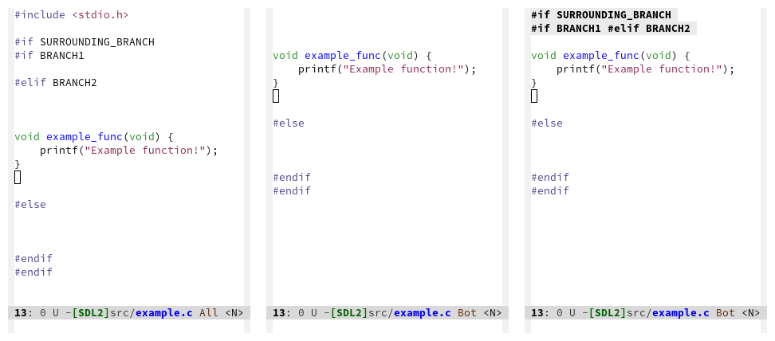

# preprocessor-collect.el

An emacs package to track open C preprocessor branches and collect them for display at the top of the buffer window.

  

Left to right: example C file, scrolled file with preprocessor state not visible, scrolled file with preprocessor-collect showing preprocessor state.

Use `(preprocessor-collect-toggle-overlay-ifdefs)` to enable/disable the state popup.

Warning: this is a hacky elisp learning experiment, not polished and undoubtedly with bugs.
